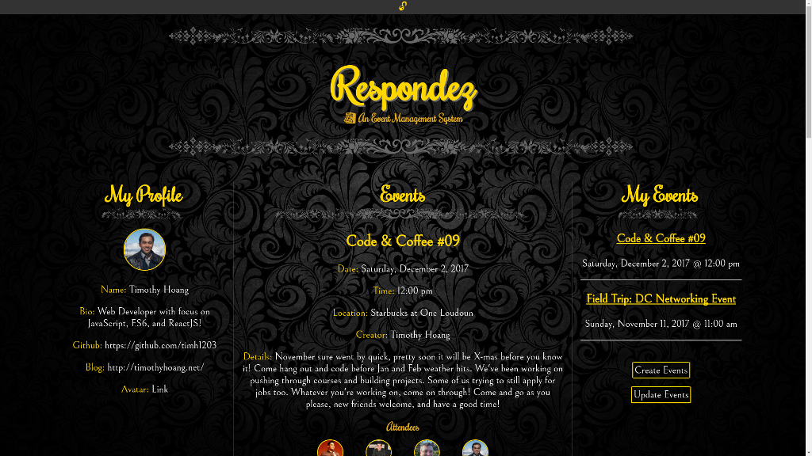

<figure><figcaption style=" text-align: center;">Respondez App</figcaption></figure>

# About
- The Respondez App is a lightweight event management system
- It was named off of the popular expression "respondez s'il vous plait", or R.S.V.P. for short 
- I want to built this out of the desire for our [Free Code Camp Ashburn Group](https://free-code-camp-ashburn.github.io/website/) so we can manage our events external from popular platforms such as Facebook or Meetup
- Best used for other Free Code Camp Groups who want to have their own Event/RSVP/Comment system

## Features
- Log in and authenticate with your Github account
- Event system for user to create, update, and remove their events
- RSVP system for user to add and remove their responses
- Comment system for user to write and delete their comments
- Events attend system for user to view past attended events

## Minor Features
- Rule of 3: The event list, user attended list, and the update event lists will only show the latest 3 entries respectively
- Spinning loader during login and page loading
- Deleted events are also removed from a user's attended list
- View user github description on hover over rsvp photo of Attendees section
- View date and time of comments on hover of Comments section
- View location of events on hover of My Events section

## Technologies
- [Create-React-App](https://github.com/facebookincubator/create-react-app) for the framework
- [Firebase](https://firebase.google.com/) for database storage
- [Immutability-Helper](https://github.com/kolodny/immutability-helper) for deep state manipulation
- [Github Pages](https://github.com/tschaub/gh-pages) for app deployment 
- [React Spinners](https://github.com/davidhu2000/react-spinners) for loading spinners
- See package.json for other technologies

# To run this project
## Method 1: Visit deployed website
1. Visit https://timh1203.github.io/respondez-app/ to view deployed app

## Method 2: Download repo to view on local computer
1. Have NPM and NodeJS installed on your computer
2. Copy the URL address this repo: https://github.com/timh1203/respondez-app.git
3. Open the terminal and go to the directory of choice, then run `git clone https://github.com/timh1203/respondez-app.git` 
3. Run `npm install` to install all the depedencies of the app
4. Copy `src/helpers/baseExample.js` to `src/helpers.base.js` and fill in your Firebase config details
5. Run `npm start` to start the server
6. The app should auto-load with Create React App, otherwise, navigate to `localhost:3000` on your browser

<!-- # To use this project for your own groups -->